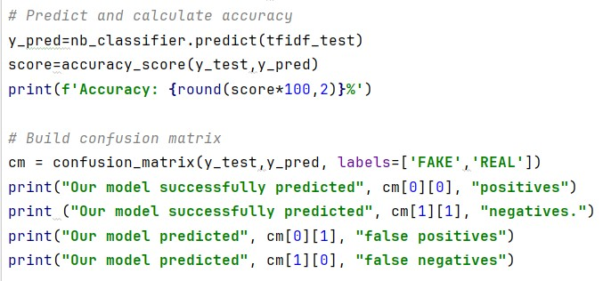
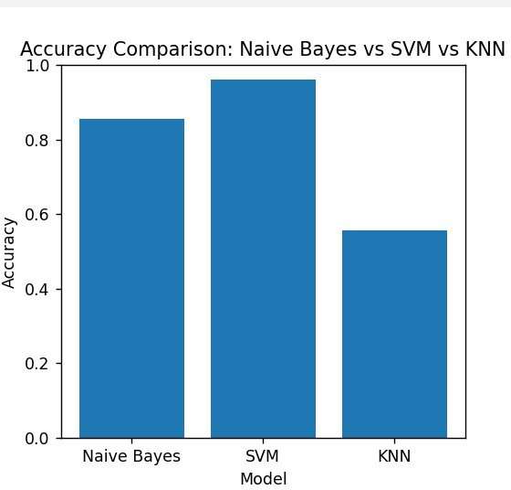

# Detecting Fake News
> Project: Detecting fake news on social networks

> **SVM (Support Vector Machine)** model is applied to classify social media posts into types: real news and fake news, helping to improve information quality and minimize the risk of spreading false information.
## Contents
+ Introduction
+ Main features
+ Technology used
+ Results
+ License
## Introduction
This project uses the **SVM (Support Vector Machine)** machine learning model to detect fake news on social media platforms. By analyzing posts and data from social networks such as Facebook, Twitter, and Instagram, the model will classify content into "real" or "fake" posts. The goal is to help users and organizations quickly detect false information, protecting the community from the risks of fake news.
## Key Features
+ Data Collection: Using the standard dataset on **Kaggle** with size 94.14 MB, 20800 news. Data is divided into columns id, title, author, text and label
+ Data Preprocessing: Conduct text preprocessing including removing stop words, text normalization, word segmentation (tokenization) and converting text into feature vectors.
+ SVM Classification: Using SVM model to classify articles into "real news" and "fake news". The model is trained on the labeled dataset.
+ Model Evaluation: Evaluate the model's performance through metrics such as Accuracy, Precision, Recall, F1-Score.
Technology used
+ Programming language: Python
+ Machine learning library: scikit-learn (SVM), pandas, numpy
+ Text preprocessing: nltk
+ Data analysis tool: matplotlib
## Results
### Data preprocessing
With the original CSV file data size of 94.14MB and 20800 items, after removing the attributes and data with low values, we have an input data set with a size of 29.7 MB and 5200 items

### Accuracy

### Comparison
After applying the SVM model, the model achieved a relatively high reliability of 96.23%, meeting expectations
We also compared it with other models such as Navie Bayes, KNN. The results show that the SVM model is the most optimal model compared to other models
|Navie Bayes|SVM|KNN|
|:--|:---|:-----|
|85.62%|96.23%|55.6%|

Here is the comparison chart:

## License
This project is licensed under the **MIT License**.
